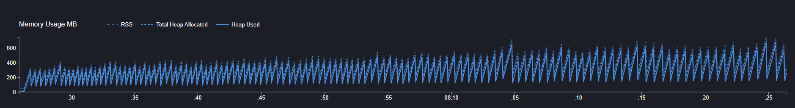
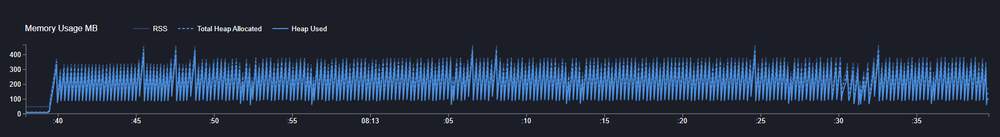

# Nuxt 3 - Vuetify - Minimal Starter

Look at the [Nuxt 3 documentation](https://nuxt.com/docs/getting-started/introduction) to learn more.

## Clinic test with Vuetify

## Clinic test without Vuetify
To test this, remove VApp && VMain from app.vue

